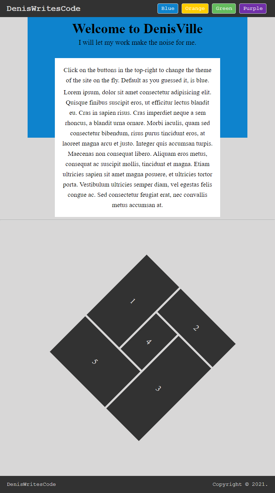

# Mosaic Layout

## Stack Used
- HTML
- CSS
- CSS Grid & Variables
- Vanilla JS

1. Set variables *theme-color* in document *:root*. After that, give each button a color of its own **CSS Variables**. 
2. When a button is clicked, using JS `getComputedStyle` get its color value. Set this value as the new *theme-color*.

- [ ] The content should fit the entire screen i.e. Snap to fit.
- [ ] Display images inside the grid.
- [ ] The images should be clickable.
